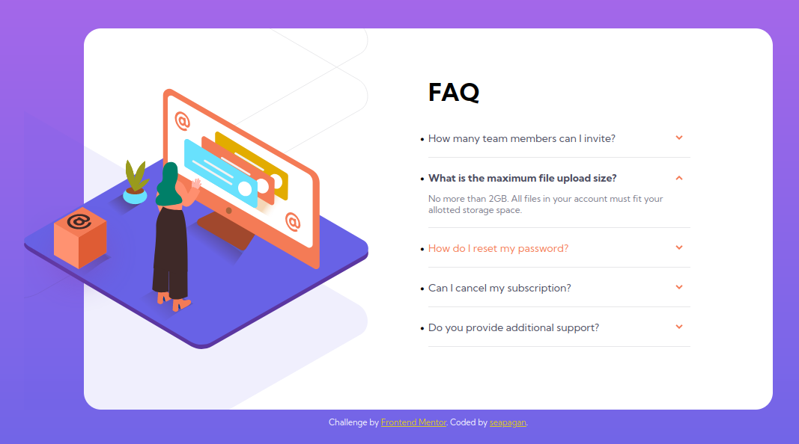

# Frontend Mentor - FAQ accordion card solution

This is a solution to the [FAQ accordion card challenge on Frontend Mentor](https://www.frontendmentor.io/challenges/faq-accordion-card-XlyjD0Oam). Frontend Mentor challenges help you improve your coding skills by building realistic projects.

## Table of contents

- [Frontend Mentor - FAQ accordion card solution](#frontend-mentor---faq-accordion-card-solution)
  - [Table of contents](#table-of-contents)
  - [Overview](#overview)
    - [The challenge](#the-challenge)
    - [Screenshot](#screenshot)
    - [Links](#links)
  - [My process](#my-process)
    - [Built with](#built-with)
    - [What I learned](#what-i-learned)
    - [Useful resources](#useful-resources)
  - [Author](#author)

## Overview

### The challenge

Users should be able to:

- View the optimal layout for the component depending on their device's screen size
- See hover states for all interactive elements on the page
- Hide/Show the answer to a question when the question is clicked

### Screenshot

### Links

- Solution URL: [Frontend Mentor](https://www.frontendmentor.io/solutions/faq-accordian-card-ZuXU27W2J6)
- Live Site URL: [Github Pages](https://seapagan-fem.github.io/faq-accordian-card/)

## My process

### Built with

- Semantic HTML5 markup
- CSS custom properties
- Flexbox
- CSS Grid

### What I learned

Styling the images was a challenge. While the finished page looks close to the
brief, I'm not sure if this is the best way to do it. However, I did learn a lot
about multiple background images and the css `background-image` style plus it's
associated `background-position` and `background-size` tags.

Hopefully my Semantic HTML is better this time too.

### Useful resources

- [W3 Schools](https://www.w3schools.com/cssref/pr_background-position.asp)
  - This helped me to understand the multiple property values for
    `background-position`, especially the `x% y%` syntax I ended up using for
    the shadow image on desktop resolution.

## Author

- Website - [Grant Ramsay](https://www.gnramsay.com)
- Frontend Mentor - [@seapagan](https://www.frontendmentor.io/profile/seapagan)
- Twitter - [@gnramsay_dev](https://www.twitter.com/gnramsay_dev)
